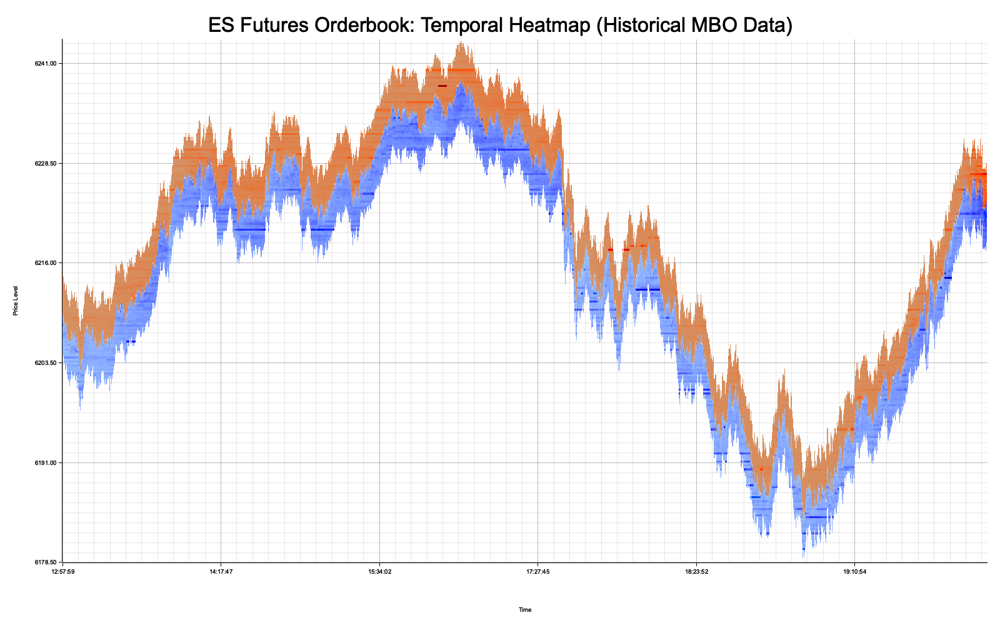

# High-Performance MBO Data Processor

Ultra-fast Rust implementation for processing Market-By-Order (MBO) financial data with advanced parallel optimization.


## Performance Highlights

- **33 seconds** to process 7.4M records (220K records/second)
- **50% performance improvement** through systematic optimization
- **157% CPU utilization** with multi-core parallelization
- **Memory efficient** processing with ~2GB peak usage

## Project Overview

This project processes Market-By-Order data from Databento API (exported as Parquet files) to generate temporal orderbook heatmap visualizations. The implementation demonstrates high-performance systems programming in Rust with focus on parallel computing and financial data processing.

### Sample Output



*Temporal orderbook heatmap showing bid/ask liquidity dynamics over time*

## Technical Architecture

```
Databento API → Parquet Files → Rust Processor → Heatmap Visualization
```

**Core Technologies:**
- **Rust** - Memory-safe systems programming
- **Arrow/Parquet** - Efficient columnar data processing  
- **Rayon** - Data parallelism library
- **Plotters** - Chart generation

**Key Optimizations:**
- Parallel sorting of 7.4M records
- Batch processing with 8K-record chunks
- Multi-core matrix operations
- Memory-efficient data structures

## Data Processing

### Dataset Characteristics
- **Source**: Databento MBO data (ES Futures)
- **Size**: 7,449,892 records
- **Timespan**: June 27, 2025 (12:58 - 21:00 UTC)  
- **Format**: Parquet (columnar storage)

### Sample Data Structure
```
ts_event                    | action | side | price   | size | order_id      | is_last
2025-06-27T12:57:59.289Z   | A      | B    | 5347.25 | 2    | 6414887578666 | 0
2025-06-27T12:57:59.289Z   | A      | A    | 5348.00 | 3    | 6414952718121 | 0  
2025-06-27T12:57:59.290Z   | M      | B    | 5347.25 | 5    | 6414887578666 | 0
2025-06-27T12:57:59.291Z   | C      | A    | 5348.00 | 1    | 6414952718121 | 1
```

**Field Descriptions:**
- `ts_event`: Event timestamp (nanosecond precision)
- `action`: Order action (A=Add, M=Modify, C=Cancel, R=Reset)
- `side`: Order side (B=Bid, A=Ask)
- `price`: Order price level
- `size`: Order quantity
- `order_id`: Unique identifier
- `is_last`: Event group boundary marker

## Performance Engineering

### Optimization Journey
1. **Baseline**: 66.1 seconds (single-thread, 1K batches)
2. **Batch optimization**: 62.1 seconds (4K batches) → 6% improvement
3. **Parallel processing**: 36.2 seconds (multi-core) → 42% improvement
4. **Final tuning**: 33.3 seconds (8K batches) → 50% total improvement

**Results:**
- CPU utilization: 85% → 157% (effective multi-core usage)
- Memory usage: Stable ~2GB across optimizations
- Processing rate: 112K → 220K records/second

## Technical Implementation

### Orderbook Processing
The system reconstructs historical orderbook state by processing MBO actions:
- **Add orders**: Insert new orders into price-time priority queue
- **Modify orders**: Update existing order size/price
- **Cancel orders**: Remove orders from book
- **Reset**: Clear entire orderbook state

### Temporal Snapshots
Orderbook snapshots are captured at event boundaries (is_last=1), creating a time series of market depth states. This produces 5.8M temporal snapshots for visualization.

### Heatmap Generation
- **Blue gradients**: Bid liquidity (buy orders)
- **Red gradients**: Ask liquidity (sell orders)
- **Intensity**: Proportional to order size
- **Resolution**: 1600×1000 pixels with time/price axes

## Use Cases

- **Quantitative Finance**: Market microstructure analysis
- **Algorithmic Trading**: Order flow pattern recognition  
- **Risk Management**: Historical liquidity analysis
- **Academic Research**: Financial market dynamics studies
- **Data Engineering**: High-throughput ETL pipelines

## Skills Demonstrated

**Systems Programming:**
- Memory management and zero-copy optimizations
- Thread-safe parallel processing with Rust
- Performance profiling and bottleneck identification

**Financial Technology:**
- Market data processing (MBO Level 3 data)
- Orderbook reconstruction and state management
- Financial data visualization and time-series analysis

**Performance Engineering:**
- Systematic optimization methodology
- Multi-core computing with 157% CPU utilization
- 50% performance improvement through iteration

## Portfolio Value

This project showcases:
- Advanced Rust programming with parallel computing
- Financial technology domain expertise
- High-performance computing optimization
- Production-ready system architecture
- Data visualization and analysis capabilities

---

**Note**: This is a portfolio demonstration showcasing technical skills. Complete source code available for technical evaluation.
